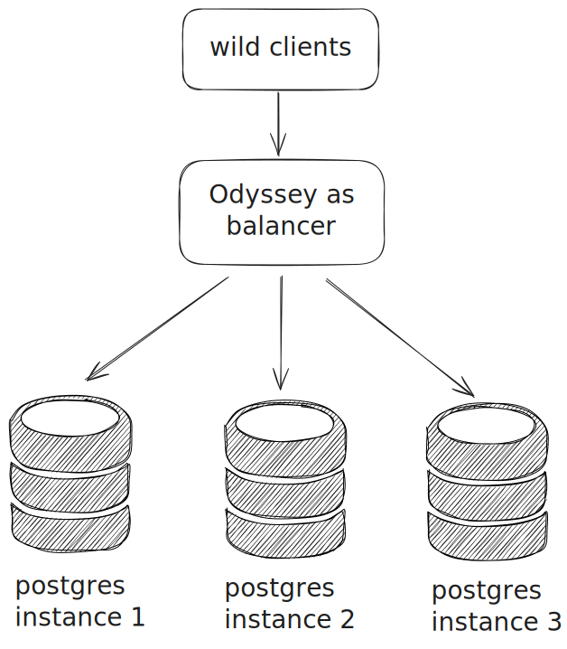

# Balancing load with Odyssey
*since 1.4.1*

Load balancing enables Odyssey to efficiently distribute incoming client
queries across multiple PostgreSQL servers. This improves resource utilization,
enhances throughput, and ensures high availability in large-scale deployments.
With load balancing, Odyssey manages the assignment of connections or requests,
helping to prevent any single server from becoming a bottleneck.



Odyssey transparently routes queries to available PostgreSQL backends
based on the selected balancing mode, helping to maximize performance
and reliability without requiring application-level logic changes.

----

## Configration

You will simply need to specify several hosts in your storage section:
```plaintext
storage "postgres_server" {
	type "remote"
	host "pg-host-1:5432,pg-host-2:5432,pg-host-3:5432"
}
```

See [storage configuration guide](../configuration/storage.md)
for more about storage section.

## Host selection

Host is selected randomly, but with next priorities:

0. **Localhost**. Localhost endpoints will be tried first.
1. **Availability zone**. If `availability_zone` is set in [global section](../configuration/global.md), the endpoints with equals az will be tried second.
2. **Target session attributes**. Works if [TSA](tsa.md) is specified in some way.
Endpoints with equals target session attributes will be tried third.

## Pool settings

The pools in unique per each endpoint in host, so if you set `pool_size` to 10,
you will get 10 pools per each host, and if there is 3 hosts, you will get 30
total connections.