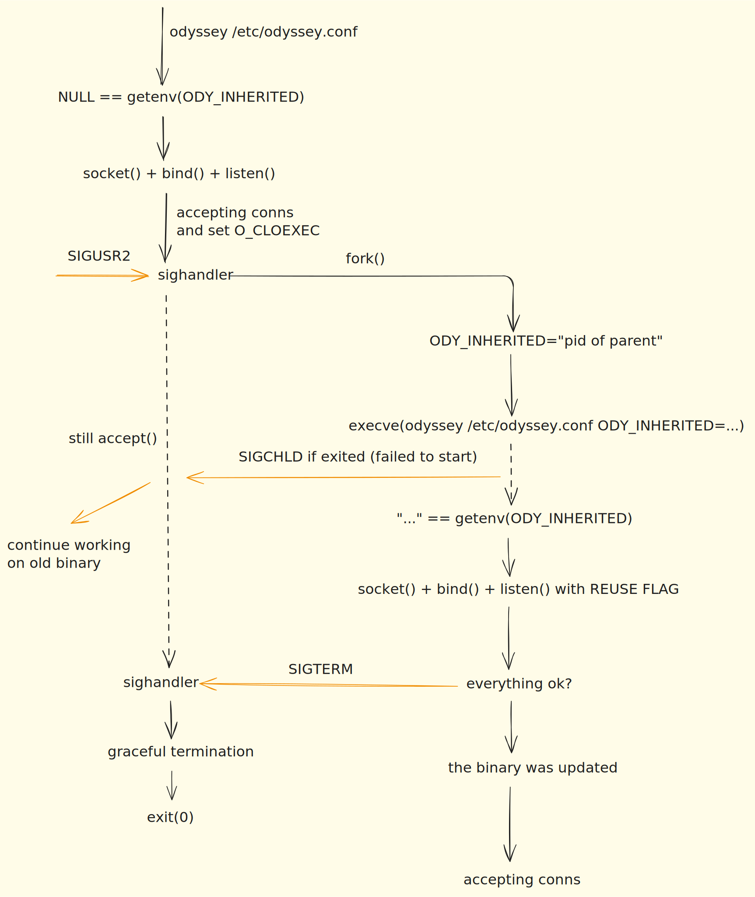

# Online restart

Sometimes you may need to upgrade Odyssey binary or make some changes
in config, that is not reloaded with SIGHUP.

The main idea is to do this without downtime with two Odyssey instances:
the first will serve all the current connections, while the second will accept all new connections.

Odyssey have several ways to perform online restart. The way of perftorming it depends
on version you use.

----

## Since 1.5.0

At version 1.5.0 nginx-like way of performing online restart was introduced.
It follows the next scheme:


Thus, to perform online restart you will simply need:

- enable reuse port for accepting from two instances: [bindwith_reuseport](../configuration/global.md#bindwith_reuseport)
- send `SIGUSR2` to Odyssey instance, ex.: `kill -sUSR2 $(pidof odyssey)`

### SystemD configuration

You will need Odyssey build vs `libsystemd-dev`. On ubuntu you can install it with
```bash
sudo apt-get install libsystemd-dev
```

When running Odyssey under systemd, the service type must be configured correctly for online restart to work:

**Recommended**: Use `Type=notify` with systemd notify support.

The online restart mechanism uses `fork()` + `execve()` to spawn a new process that replaces the parent. With `Type=notify`, Odyssey explicitly tells systemd about the new main process PID, allowing seamless handoff during online restart.

Example systemd service configuration:

```ini
[Service]
Type=notify
ExecStart=/usr/bin/odyssey /etc/odyssey/odyssey.conf
Restart=on-failure
```

**Alternative** (for older Odyssey versions without systemd notify support): Use a wrapper script with `Type=simple`:

```bash
#!/bin/bash
# /usr/local/bin/odyssey-wrapper.sh
/usr/bin/odyssey /etc/odyssey/odyssey.conf &
ODYSSEY_PID=$!

# Keep wrapper alive, track any odyssey process
while kill -0 $ODYSSEY_PID 2>/dev/null || pgrep -x odyssey >/dev/null; do
    sleep 5
done
```

Then configure systemd:

```ini
[Service]
Type=simple
ExecStart=/usr/local/bin/odyssey-wrapper.sh
Restart=on-failure
```

**Note**: Unix domain sockets do not support `SO_REUSEPORT` and cannot be shared between parent and child processes. For online restart to work, you must either:
- Use only TCP sockets (recommended), or
- Remove Unix socket listeners from your configuration

### Disabling online restart

If you don't want Odyssey to perform online restart on `SIGUSR2`, you can disable
this feature with [enable_online_restart](../configuration/global.md#enable_online_restart).

### Dropping old connection

It is possible to control connections dropping on old Odyssey instance.

By default, one connection per second for each worker thread will be dropped
between transaction blocks. But if you want to disable it and allow all the
connections to work until disconnection, you can set [drop_enabled](../configuration/global.md#drop_enabled) option to `no`:

```txt
online_restart_drop_options {
    drop_enabled no
}
```

## On 1.3, 1.4, 1.4.1

There is [enable_online_restart](../configuration/global.md#enable_online_restart) feature.

Enabling it to `yes` will make Odyssey to watch if there is new another instance of Odyssey
by getting lock files at [locks_dir](../configuration/global.md#locks_dir).

When a new Odyssey instance is run, an old performs graceful termination. But you need to run
a new version manually. You will also need enabled [bindwith_reuseport](../configuration/global.md#bindwith_reuseport).
